# Harness — Architecture with Mermaid Diagrams

> An AI agent harness for coding, review, autonomous agents, and more.
> Open-source Electron + React + TypeScript application.

> **Note:** These diagrams use [Mermaid](https://mermaid.js.org/). They render automatically on GitHub, GitLab, Notion, and with any Markdown viewer that has a Mermaid plugin.

---

## Table of Contents

1. [High-Level Architecture](#1-high-level-architecture)
2. [Process Lifecycle](#2-process-lifecycle)
3. [Sub-Agent Orchestration Flows](#3-sub-agent-orchestration-flows)
4. [Deslopper Pipeline](#4-deslopper-pipeline)
5. [Training / Prompt Evolution](#5-training--prompt-evolution)
6. [Doc Awareness System](#6-doc-awareness-system)
7. [Provider Abstraction](#7-provider-abstraction)
8. [Git Integration Flow](#8-git-integration-flow)
9. [Agent Configuration Model](#9-agent-configuration-model)
10. [UI Layout](#10-ui-layout)
11. [Directory Structure](#11-directory-structure)
12. [Build Order](#12-build-order)

---

## 1. High-Level Architecture

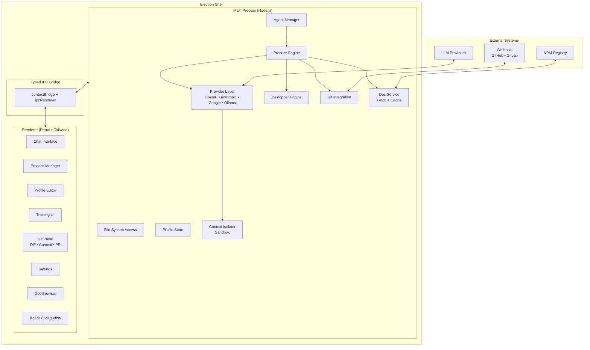

---

## 2. Process Lifecycle

Every agent run — chat, code gen, review, autonomous task — follows this lifecycle:

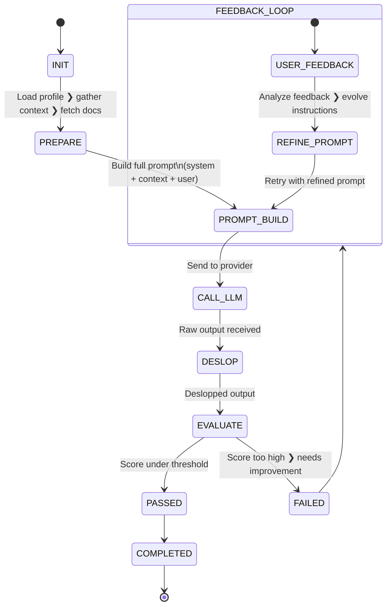

### Retry & Iteration Logic

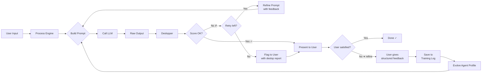

---

## 3. Sub-Agent Orchestration Flows

### 3.1 Sequential Delegation

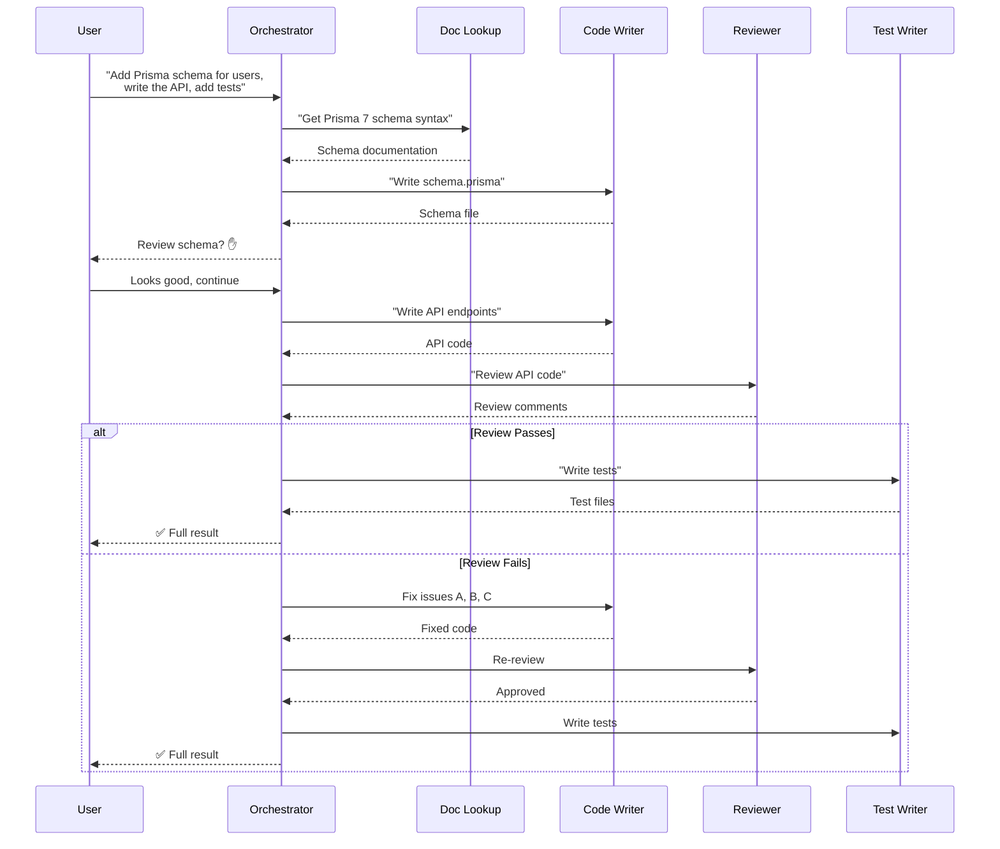

### 3.2 Parallel Delegation

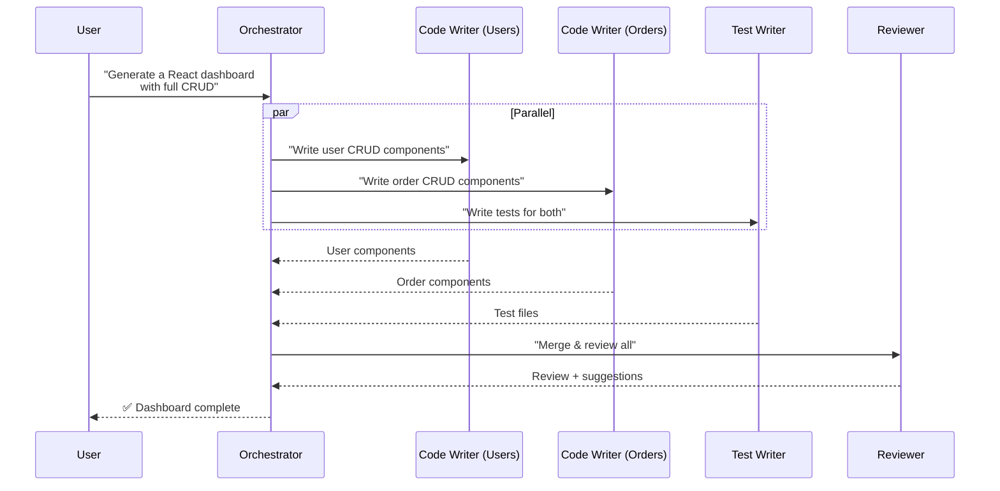

### 3.3 Sub-Agent Toggling

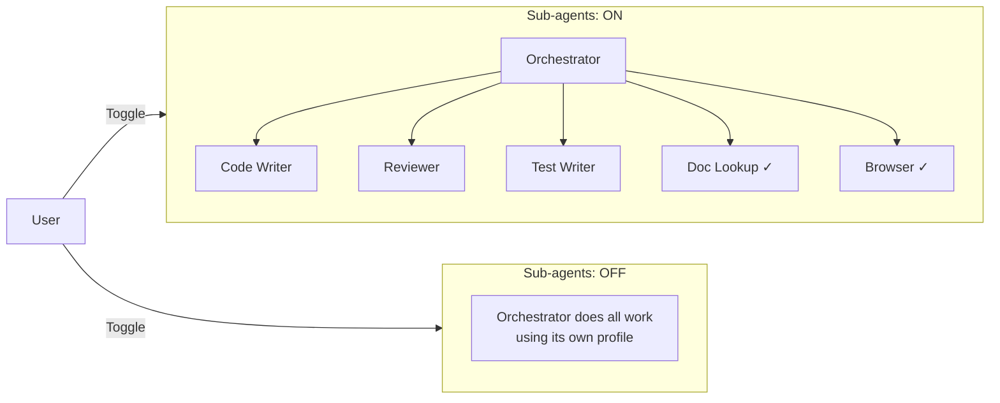

### 3.4 Manual Delegation

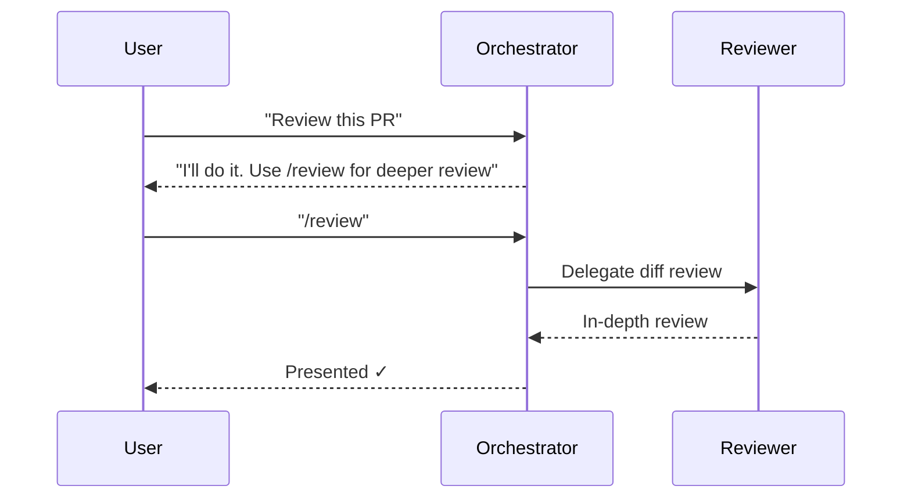

---

## 4. Deslopper Pipeline

```mermaid
flowchart TB
    RAW[Raw LLM Output] --> TOK[Tokenizer]
    TOK --> SS[Sentence Splitter]
    SS --> PM[Pattern Matcher]
    
    subgraph Rules["Rule Engine"]
        direction TB
        PR[Pattern Rules<br/>• Hedge words<br/>• Fake gratitude<br/>• Pompous verbs]
        SR[Style Rules<br/>• Verbosity<br/>• Tone markers<br/>• Bullet density]
        SIG[Signal Rules<br/>• Model-specific tells<br/>• Confidence markers]
        CR[Custom Rules<br/>• User-defined]
    end
    
    PM --> Rules
    
    Rules --> SC[Score Calculator<br/>0 - 100]
    SC --> TC{Threshold Check}
    
    TC -->|"< 30"| PASS[PASS ✓<br/>Output delivered]
    TC -->|"30-60"| FLAG[FLAG 🔶<br/>Show warnings to user]
    TC -->|"> 60"| BLOCK[BLOCK 🔴<br/>Auto-rewrite or block]
    
    BLOCK --> RW{Strategy?}
    RW -->|Auto-rewrite| RW2[Deslopper Rewriter<br/>strips & rewrites]
    RW -->|Flag & ask| QU[User decides]
    
    RW2 --> RP[Re-scored Output]
    QU --> RP
    
    FLAG --> REP[Deslop Report<br/>• What was flagged<br/>• Line numbers<br/>• Suggested fixes]
    REP --> OUT[Deliver + Report]
    
    PASS --> OUT
    
    subgraph Builtin_Slop["Built-in Slop Patterns"]
        H1[• "I think" / "perhaps" / "it seems"]
        H2[• "Great question!" / "I'd be happy to help"]
        H3[• "leverage" / "utilize" / "delve"]
        H4[• "In order to" → "To"]
        H5[• "This is definitely the best approach"]
        H6[• 5+ consecutive bullet points]
        H7[• "First, let me explain..." / "Now that we've covered"]
        H8[• "Interesting perspective"]
    end
```

---

## 5. Training / Prompt Evolution

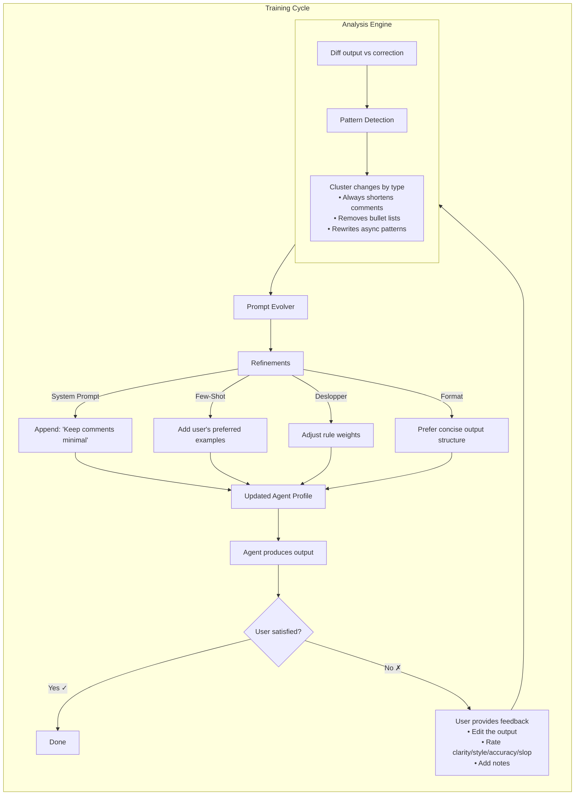

### Feedback Data Model

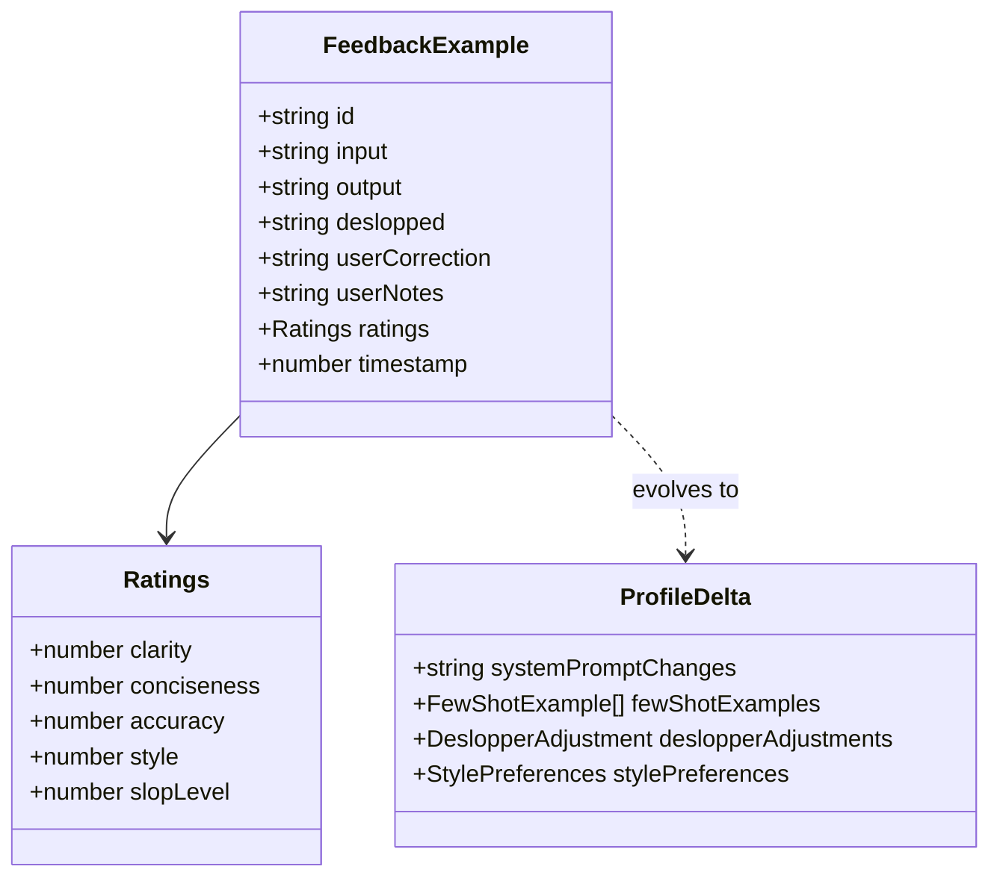

---

## 6. Doc Awareness System

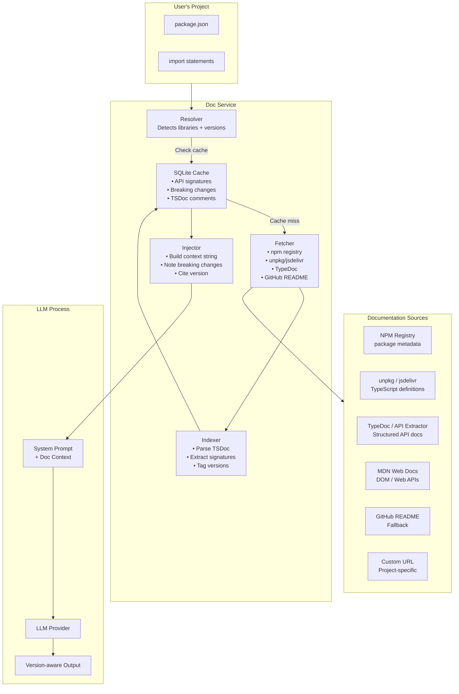

### Version Awareness Detail

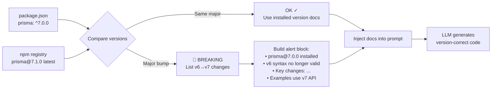

---

## 7. Provider Abstraction

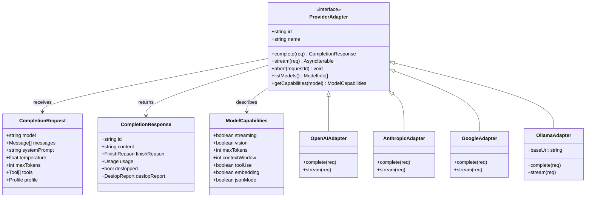

### Provider Selection Flow

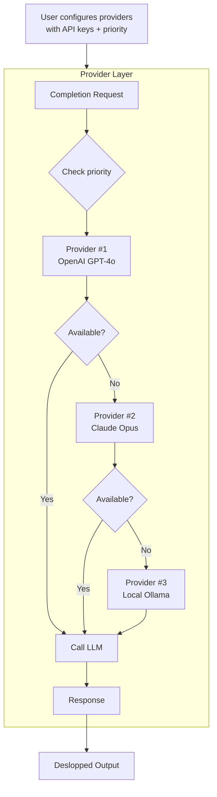

---

## 8. Git Integration Flow

```mermaid
flowchart TB
    subgraph IDE["User's IDE"]
        CHANGE[User makes changes]
        SAVE[Saves files]
    end
    
    subgraph Harness["Harness"]
        DIRTY[Detects dirty repo]
        DIFF[GitService.getDiff()]
        DVIEW[Render diff in UI]
        
        subgraph Commit["Commit Generation"]
            CDIFF[Structured diff] --> CPROMPT[Build commit prompt<br/>+ Conventional Commits spec]
            CPROMPT --> CLLM[LLM generates<br/>commit message]
            CLLM --> CDES[Deslopper<br/>(no verbose commit messages)]
            CDES --> CEDIT[User can edit]
            CEDIT --> CEXEC[git commit]
        end
        
        subgraph PR["PR Generation"]
            BINFO[Branch info<br/>+ commit history] --> BPROMPT[Build PR prompt]
            BPROMPT --> BLLM[LLM generates<br/>title + description]
            BLLM --> BDES[Deslopper]
            BDES --> BEDIT[User edits]
            BEDIT --> BEXEC[Create PR<br/>via GitHub/GitLab API]
        end
    end
    
    CHANGE -->|File watcher| DIRTY
    DIFF --> DVIEW
    DVIEW -->|"Generate Commit"| Commit
    DVIEW -->|"Generate PR"| PR
```

### Git Diff → Commit → PR Pipeline

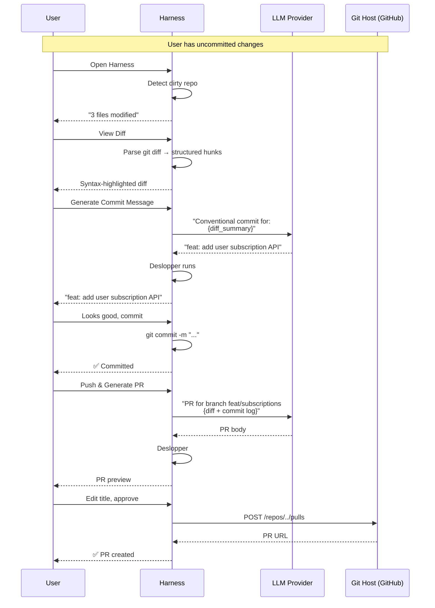

---

## 9. Agent Configuration Model

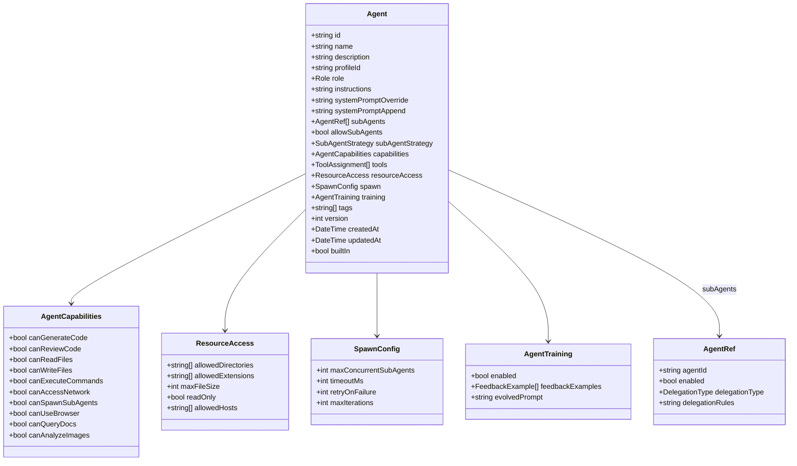

### Sub-Agent Process Flow (Internal)

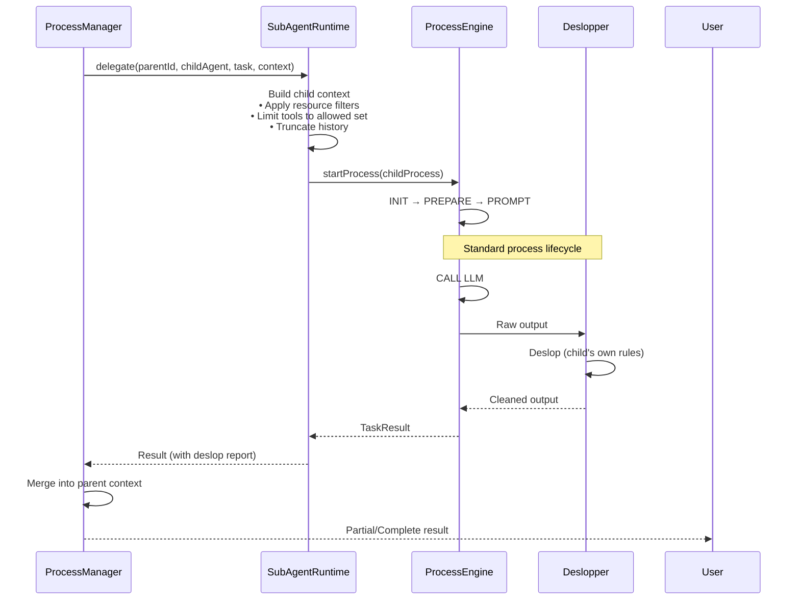

---

## 10. UI Layout

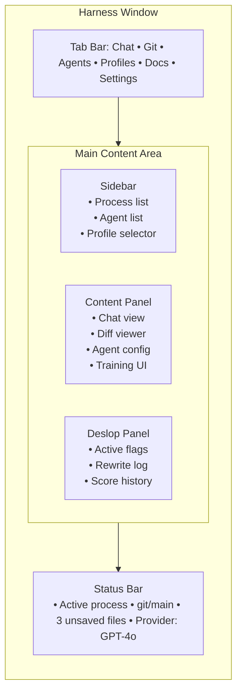

### Component Tree

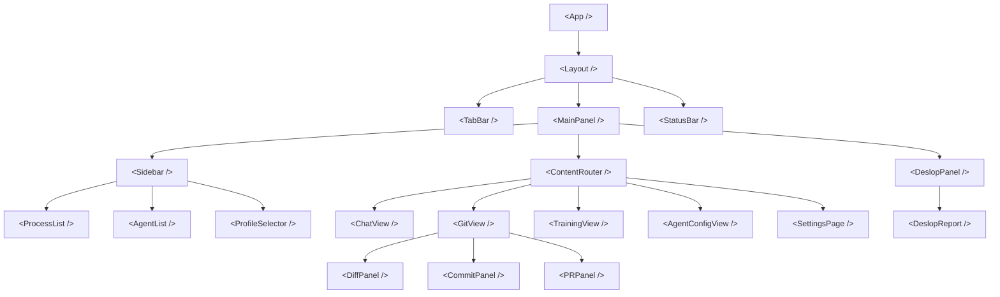

---

## 11. Directory Structure

```
harness/
├── package.json
├── tsconfig.json
├── electron-builder.yml          # Electron packaging config
├── tailwind.config.ts
├── vite.config.ts
├── .gitignore                   # node_modules, dist, user config, doc-cache
│
├── src/
│   ├── main/                    # Electron main process
│   │   ├── index.ts             # App entry, window creation
│   │   ├── ipc-handlers.ts      # IPC handler registration
│   │   ├── process-engine.ts    # Process orchestrator
│   │   ├── deslopper/
│   │   │   ├── engine.ts        # Deslopper core
│   │   │   ├── rules/           # Rule definitions
│   │   │   │   ├── pattern-rules.ts
│   │   │   │   ├── style-rules.ts
│   │   │   │   └── custom-rules.ts
│   │   │   ├── scorer.ts        # Slop scoring
│   │   │   └── rewriter.ts      # Auto-rewrite engine
│   │   ├── providers/
│   │   │   ├── adapter.ts       # ProviderAdapter interface
│   │   │   ├── openai.ts        # OpenAI adapter
│   │   │   ├── anthropic.ts     # Anthropic adapter
│   │   │   ├── google.ts        # Google AI adapter
│   │   │   ├── ollama.ts        # Ollama adapter
│   │   │   └── registry.ts      # Provider registry
│   │   ├── agents/
│   │   │   ├── manager.ts       # Agent CRUD
│   │   │   ├── runtime.ts       # Sub-agent spawn/delegate
│   │   │   └── presets.json     # Built-in presets
│   │   ├── git/
│   │   │   ├── service.ts       # Git operations
│   │   │   ├── diff-parser.ts   # Structured diff parsing
│   │   │   ├── commit-gen.ts    # Commit message generation
│   │   │   └── pr-gen.ts        # PR description generation
│   │   ├── docs/
│   │   │   ├── service.ts       # Documentation fetch & cache
│   │   │   ├── resolver.ts      # Library/version detection
│   │   │   ├── fetcher.ts       # Fetch from sources
│   │   │   ├── indexer.ts       # Parse & index docs
│   │   │   └── injector.ts      # Build context snippets
│   │   ├── profiles/
│   │   │   ├── manager.ts       # Profile CRUD
│   │   │   └── evolver.ts       # Prompt evolution engine
│   │   └── training/
│   │       ├── analyzer.ts      # Feedback pattern analysis
│   │       └── logger.ts        # Training log persistence
│   │
│   ├── renderer/                # React frontend
│   │   ├── index.html
│   │   ├── main.tsx             # React entry
│   │   ├── App.tsx              # Root component
│   │   ├── components/
│   │   │   ├── layout/
│   │   │   │   ├── Sidebar.tsx
│   │   │   │   ├── TabBar.tsx
│   │   │   │   ├── StatusBar.tsx
│   │   │   │   └── DeslopPanel.tsx
│   │   │   ├── chat/
│   │   │   │   ├── ChatView.tsx
│   │   │   │   ├── MessageBubble.tsx
│   │   │   │   └── StreamingOutput.tsx
│   │   │   ├── git/
│   │   │   │   ├── DiffPanel.tsx
│   │   │   │   ├── CommitPanel.tsx
│   │   │   │   └── PRPanel.tsx
│   │   │   ├── agents/
│   │   │   │   ├── AgentConfigView.tsx
│   │   │   │   └── AgentList.tsx
│   │   │   ├── profiles/
│   │   │   │   ├── ProfileEditor.tsx
│   │   │   │   └── ProfileSelector.tsx
│   │   │   ├── training/
│   │   │   │   ├── TrainingView.tsx
│   │   │   │   └── FeedbackForm.tsx
│   │   │   └── settings/
│   │   │       ├── ProviderSettings.tsx
│   │   │       └── DeslopperSettings.tsx
│   │   ├── stores/
│   │   │   ├── process-store.ts  # Zustand
│   │   │   ├── agent-store.ts
│   │   │   ├── git-store.ts
│   │   │   └── settings-store.ts
│   │   └── hooks/
│   │       ├── useProcess.ts
│   │       └── useIpc.ts        # IPC bridge hooks
│   │
│   ├── shared/                  # Shared between main & renderer
│   │   ├── ipc.ts               # IPC contract types
│   │   ├── types.ts             # Core types
│   │   ├── deslopper-types.ts   # Deslopper types
│   │   ├── agent-types.ts       # Agent types
│   │   ├── profile-types.ts     # Profile types
│   │   └── training-types.ts    # Training types
│   │
│   └── presets/                 # Shipped built-in data
│       ├── agents.json          # Standard agent presets
│       ├── profiles.json        # Built-in profiles
│       └── deslopper-rules.json # Default rule set
│
├── electron/
│   ├── main.ts                  # Electron entry
│   └── preload.ts               # contextBridge
│
└── user-config/                 # Gitignored, created at runtime
    ├── config.json              # App settings, provider keys
    ├── profiles/                # User profiles
    ├── training-logs/           # Raw feedback data
    └── doc-cache/               # Cached documentation
```

---

## 12. Build Order

```mermaid
gantt
    title Suggested Build Sequence
    dateFormat  YYYY-MM-DD
    axisFormat  %b
    
    section Phase 1: Core
    Profile system (types + manager + presets)    :p1a, 2026-05-10, 3d
    Provider adapter interface + one adapter      :p1b, after p1a, 3d
    Deslopper engine (parser + rules + scorer)    :p1c, after p1b, 4d
    
    section Phase 2: Process Loop
    Process engine (lifecycle + prompt builder)   :p2a, after p1c, 4d
    Chat UI (messaging + streaming)               :p2b, after p2a, 4d
    IPC bridge (typed handlers + preload)         :p2c, after p2b, 2d
    
    section Phase 3: Features
    Git integration (diff + commit)              :p3a, after p2c, 3d
    Doc awareness service                        :p3b, after p2c, 4d
    Agent system (manager + runtime + presets)    :p3c, after p2c, 4d
    
    section Phase 4: Polish
    Training UI + feedback loop                   :p4a, after p3c, 4d
    PR generation + diff viewer                   :p4b, after p3a, 3d
    Settings page + provider config UI            :p4c, after p2c, 2d
    
    section Phase 5: Stretch
    Vision UI evaluation                          :p5a, after p4a, 3d
    Sub-agent parallel execution                  :p5b, after p3c, 3d
    Sandbox / context isolator                    :p5c, after p4a, 3d
```

---

> Written for `D:\projects\harness`. The Mermaid diagrams render in GitHub, GitLab, Notion, Obsidian, VS Code (with plugin), and most Markdown editors.
