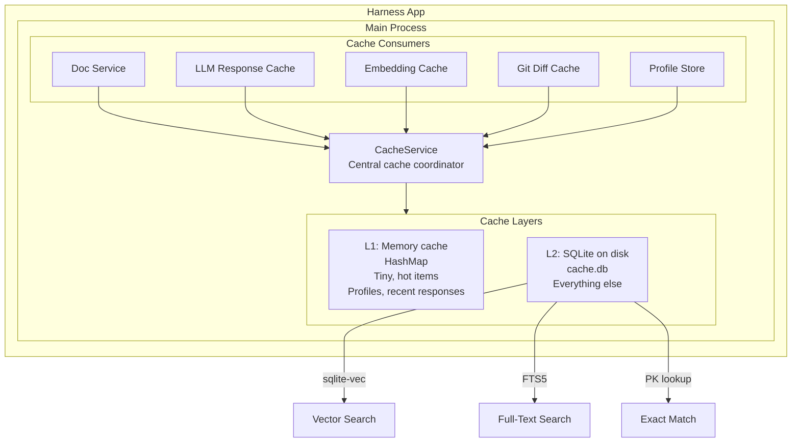
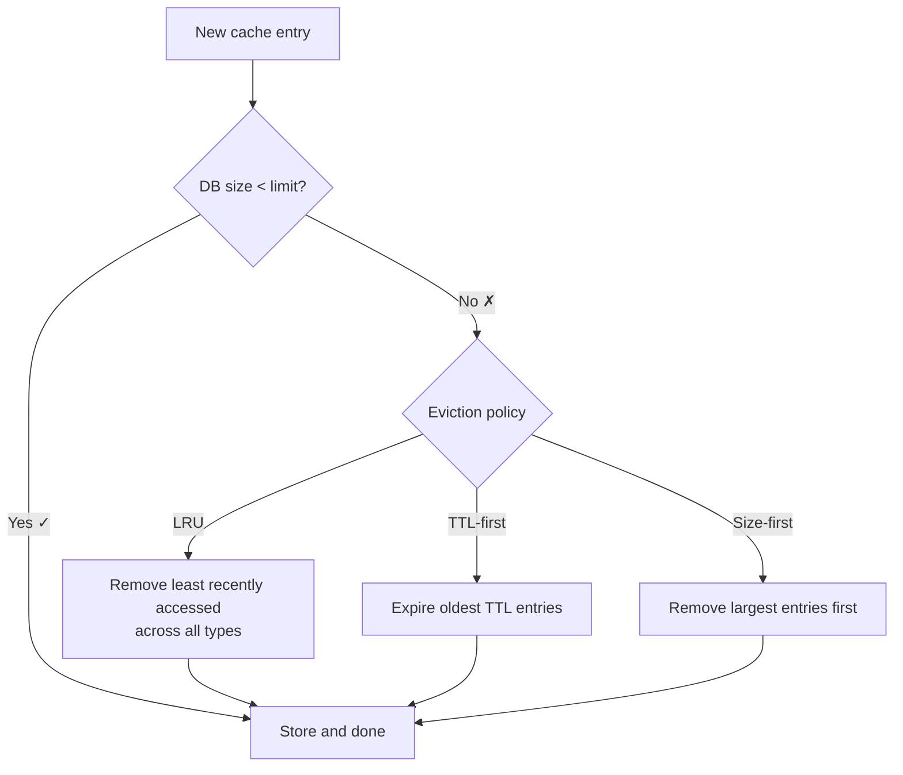
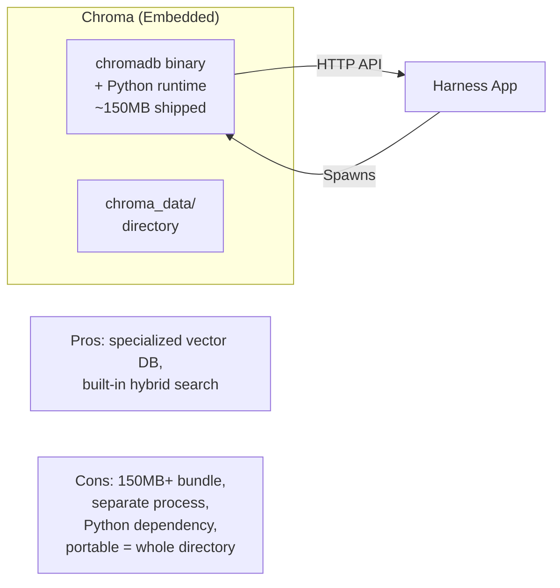
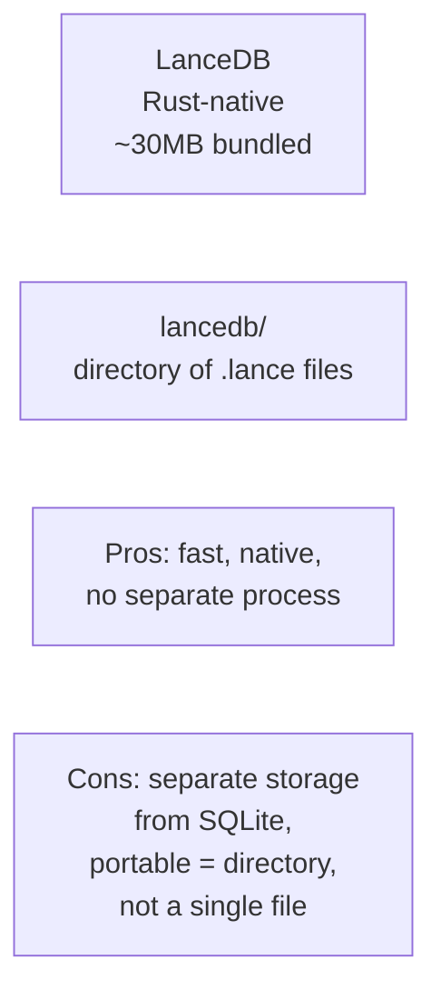
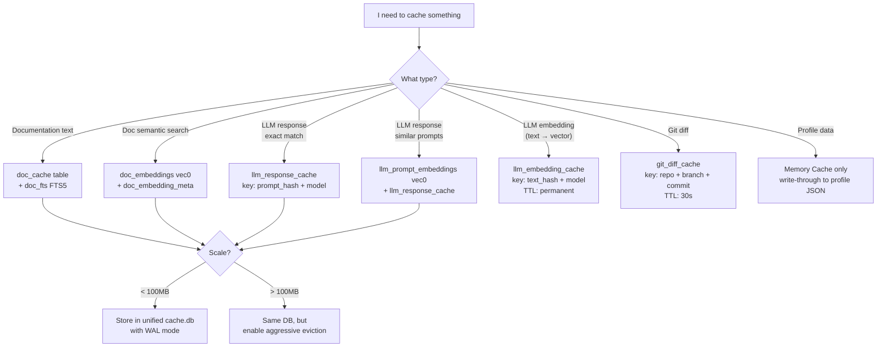
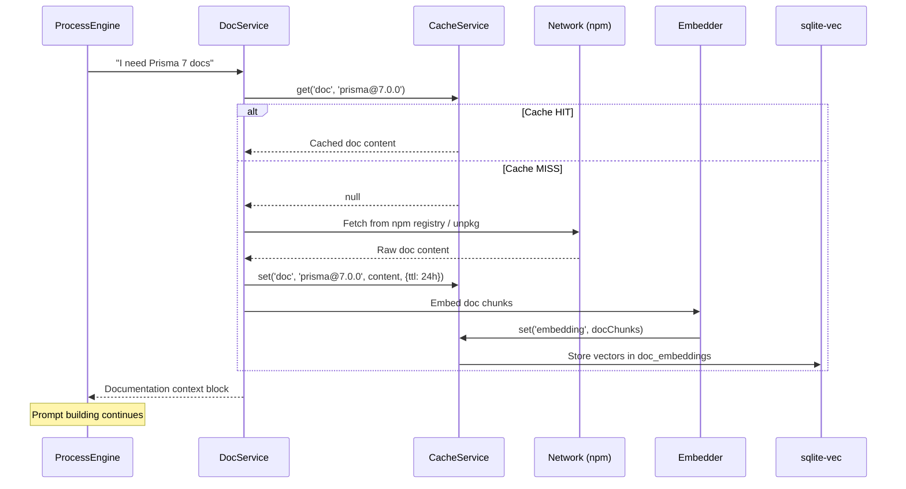
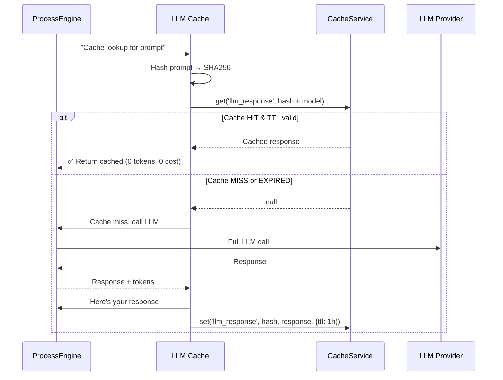
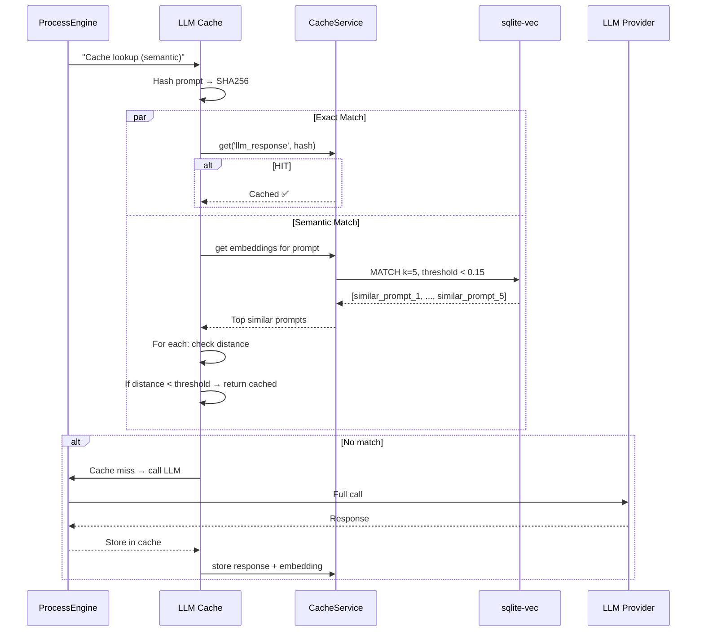

# Harness — Caching Architecture

> How, when, and what to cache. Doc content, LLM responses, embeddings, and more.

---

## Table of Contents

1. [What Needs Caching](#1-what-needs-caching)
2. [SQLite vs Vector Database — Decision Framework](#2-sqlite-vs-vector-database)
3. [Why SQLite Wins Here](#3-why-sqlite-wins-here)
4. [sqlite-vec Extension](#4-sqlite-vec-extension)
5. [Recommended Architecture: SQLite Unified Cache](#5-recommended-architecture-sqlite-unified-cache)
6. [Cache Tables](#6-cache-tables)
7. [Eviction & Freshness](#7-eviction--freshness)
8. [Alternatives Considered](#8-alternatives-considered)
9. [Diagram: Cache Decision Tree](#9-diagram-cache-decision-tree)
10. [Diagram: Cache Flow Per Cache Type](#10-diagram-cache-flow-per-cache-type)

---

## 1. What Needs Caching

| Data | Why Cache | Staleness | Size |
|------|-----------|-----------|------|
| **Library Docs** | Fetching from npm registry + TypeScript defs is slow. Avoid re-fetching on every process. | Hours-days. Check for new version on process start. | Medium (100KB–5MB per lib) |
| **Doc Search Index** | Embedding library docs so you can semantic-search them later. | Same as docs. | Large (grows with embedded docs) |
| **LLM Responses** | Identical or similar prompts should return cached results. | Minutes-hours. | Large (grows with usage) |
| **LLM Embeddings** | Embedding calls cost money. Cache per text hash. | Permanent (deterministic). | Large |
| **Profiles** | Small JSON files, but worth caching in memory. | Never (write-through). | Tiny |
| **Training Logs** | User feedback data. | Never (append-only). | Small-medium |
| **Git Diffs** | Re-parsing expensive diffs. | Seconds (file change invalidates). | Small |

---

## 2. SQLite vs Vector Database

| Aspect | SQLite + sqlite-vec | Dedicated Vector DB (Chroma, Qdrant, LanceDB) | Hybrid (Postgres + pgvector) |
|--------|--------------------|-----------------------------------------------|------------------------------|
| **Setup** | Zero. Ships with Electron. | Requires running a service or embedding a Go/Rust binary. | Requires full Postgres — overkill for desktop. |
| **Bundle size** | ~1MB (better-sqlite3) + tiny .dll for vec | 10–100MB for embedded servers | N/A (server-scale) |
| **Vector search** | Yes (sqlite-vec — HNSW, brute-force) | Yes (native, tuned) | Yes |
| **Full-text search** | Yes (FTS5 built into SQLite) | Separate index needed | Yes |
| **Semantic + FTS hybrid** | Implement in app code | Often built-in | Yes |
| **Portable** | Single .db file | Usually a directory of files | No |
| **User data portability** | Copy one file. Back up one file. | Copy a directory. | Export required. |
| **Concurrent access** | WAL mode handles it | Most handle it | Yes |
| **Win for this project** | ✅ Single file, zero setup, all caching unified | ❌ Overkill for a desktop app, adds deployment complexity | ❌ Server DB in a desktop app |

### Verdict

**SQLite with sqlite-vec is the right choice.** Here's why:

- Harness is a **desktop app** — it should be zero-config, ship in one binary
- A separate vector DB service means the user needs to install/start another service, or we embed a heavy binary → defeats "just connect an API key and go"
- sqlite-vec is a loadable extension for better-sqlite3 that gives you cosine similarity search on vectors stored in regular SQLite tables
- You get: one file for everything. FTS5 for keyword search. sqlite-vec for semantic search. User can copy their `cache.db` to another machine.

---

## 3. Why SQLite Wins Here

### 3.1 The One-File Argument

```
┌─────────────────────────────────────┐
│  User's Harness Config Directory    │
│                                     │
│  D:\Users\Sniffo\.harness\          │
│  ├── config.json                    │
│  ├── cache.db           ← ALL cache │
│  ├── profiles/                      │
│  ├── training-logs/                 │
│  └── doc-cache/         ← fallback  │
└─────────────────────────────────────┘
```

One SQLite DB with `sqlite-vec` handles every caching need. No separate vector store. No Redis. No Postgres.

### 3.2 Performance

| Operation | SQLite (WAL mode) | Notes |
|-----------|-------------------|-------|
| Exact key lookup | <1ms | Primary key on key hash |
| FTS5 keyword search | 1–5ms | Indexed on doc text |
| Vector (cosine) similarity (100K vectors) | 5–20ms | sqlite-vec with HNSW index |
| Write batch | <5ms for 100 rows | WAL mode, synchronous=OFF |

### 3.3 Size Estimates

| Cache | Estimate per user | Growth |
|-------|-------------------|--------|
| LLM responses | 1KB–50KB per entry | ~100/day → 5MB/month |
| Doc indexes | 500KB–10MB per lib | Grows with project libraries |
| Embeddings | 768 floats, ~3KB per vector | ~1000/doc → 3MB/lib |
| Training logs | 2KB per feedback | ~50/month → 100KB/month |
| Git diffs | 5KB–500KB per diff | Temporary (evicted after commit) |

Realistic steady state: **50–200MB for active users with several projects.**

---

## 4. sqlite-vec Extension

### 4.1 What Is It?

[sqlite-vec](https://github.com/asg017/sqlite-vec) is a zero-dependency SQLite extension that adds vector search as a native SQL function.

```sql
-- Load the extension
.load ./vec0

-- Create a virtual table for vectors
CREATE VIRTUAL TABLE doc_embeddings USING vec0(
  id INTEGER PRIMARY KEY,
  embedding FLOAT[768]  -- 768d vectors from text-embedding-3-small
);

-- KNN search (natively indexed)
SELECT id, distance
FROM doc_embeddings
WHERE embedding MATCH ?
  AND k = 10;  -- top 10
```

### 4.2 How It Works

```mermaid
flowchart LR
    TEXT[Text to search] --> EMB[Embedding Model<br/>OpenAI / Local]
    EMB --> VEC[Vector: [0.12, -0.34, ...]]
    
    VEC --> SQLITE[sqlite-vec<br/>KNN MATCH]
    
    SQLITE --> RESULTS[Top-K results<br/>with distance scores]
    
    subgraph Index["HNSW Index (on disk)"]
        direction TB
        N1[(Node 1)]
        N2[(Node 2)]
        N3[(Node 3)]
    end
    
    SQLITE --> Index
```

### 4.3 Compatible Embedding Models

| Model | Dimensions | Provider | Cost |
|-------|-----------|----------|------|
| `text-embedding-3-small` | 768 | OpenAI | Cheap |
| `text-embedding-3-large` | 3072 | OpenAI | More expensive |
| `embed-english-v3.0` | 1024 | Cohere | Moderate |
| `BAAI/bge-small-en-v1.5` | 384 | Local (Ollama) | Free |
| `nomic-embed-text-v1.5` | 768 | Local (Ollama) | Free |

sqlite-vec supports any dimension as long as it's consistent per table.

---

## 5. Recommended Architecture: SQLite Unified Cache

### 5.1 Component Diagram



### 5.2 L1 Memory Cache

For the hottest items — skip the disk write entirely.

```typescript
// main/cache/memory-cache.ts
class MemoryCache {
  private store: Map<string, { data: unknown; expiresAt: number }>;
  private maxSize: number;

  constructor(maxSize = 500) {
    this.store = new Map();
    this.maxSize = maxSize;
  }

  get<T>(key: string): T | null {
    const entry = this.store.get(key);
    if (!entry) return null;
    if (Date.now() > entry.expiresAt) {
      this.store.delete(key);
      return null;
    }
    return entry.data as T;
  }

  set(key: string, data: unknown, ttlMs = 60_000): void {
    if (this.store.size >= this.maxSize) {
      // Evict oldest
      const firstKey = this.store.keys().next().value;
      if (firstKey) this.store.delete(firstKey);
    }
    this.store.set(key, { data, expiresAt: Date.now() + ttlMs });
  }

  invalidate(pattern: RegExp): void {
    for (const key of this.store.keys()) {
      if (pattern.test(key)) this.store.delete(key);
    }
  }
}
```

### 5.3 Cache Service (Coordinator)

```typescript
// main/cache/service.ts
class CacheService {
  private memory: MemoryCache;
  private db: Database;  // better-sqlite3 instance
  private vec: boolean;  // sqlite-vec loaded?

  constructor(dbPath: string) {
    this.memory = new MemoryCache();
    this.db = new Database(dbPath);
    this.db.pragma('journal_mode = WAL');
    this.db.pragma('synchronous = NORMAL');
    this.db.pragma('cache_size = -64000'); // 64MB page cache

    this.initTables();
    this.loadVecExtension();
  }

  // ──────────── GENERIC ────────────

  async get<T>(cacheType: CacheType, key: string, options?: CacheOptions): Promise<T | null> {
    // 1. Check L1 memory cache
    const memKey = `${cacheType}:${key}`;
    const memHit = this.memory.get<T>(memKey);
    if (memHit) return memHit;

    // 2. Check L2 SQLite
    const row = this.db.prepare(
      `SELECT data, expires_at FROM cache_entries
       WHERE cache_type = ? AND cache_key = ?`
    ).get(cacheType, key) as Row | undefined;

    if (!row) return null;
    if (row.expires_at && Date.now() > row.expires_at) {
      this.db.prepare('DELETE FROM cache_entries WHERE cache_type = ? AND cache_key = ?')
        .run(cacheType, key);
      return null;
    }

    const data = JSON.parse(row.data) as T;

    // 3. Promote to L1 for hot access
    this.memory.set(memKey, data, options?.memoryTtlMs ?? 30_000);

    return data;
  }

  async set(cacheType: CacheType, key: string, data: unknown, options?: CacheOptions): Promise<void> {
    const serialized = JSON.stringify(data);

    this.db.prepare(
      `INSERT OR REPLACE INTO cache_entries (cache_type, cache_key, data, expires_at, created_at)
       VALUES (?, ?, ?, ?, ?)`
    ).run(
      cacheType,
      key,
      serialized,
      options?.ttlMs ? Date.now() + options.ttlMs : null,
      Date.now()
    );

    // Optionally promote to L1
    if (options?.promoteToMemory) {
      this.memory.set(`${cacheType}:${key}`, data, options.memoryTtlMs ?? 30_000);
    }
  }

  async invalidate(cacheType: CacheType, keyPattern?: string): Promise<void> {
    if (keyPattern) {
      this.db.prepare('DELETE FROM cache_entries WHERE cache_type = ? AND cache_key LIKE ?')
        .run(cacheType, keyPattern);
      this.memory.invalidate(new RegExp(keyPattern.replace('%', '.*')));
    } else {
      this.db.prepare('DELETE FROM cache_entries WHERE cache_type = ?')
        .run(cacheType);
    }
  }

  async stats(): Promise<CacheStats> { /* ... */ }
}
```

---

## 6. Cache Tables

### 6.1 Generic Cache Entries

```sql
CREATE TABLE cache_entries (
  id INTEGER PRIMARY KEY AUTOINCREMENT,
  cache_type TEXT NOT NULL,       -- 'llm_response' | 'doc' | 'embedding' | 'git_diff' | etc
  cache_key TEXT NOT NULL,        -- hash or unique identifier
  data TEXT NOT NULL,             -- JSON blob
  metadata TEXT,                  -- JSON: model used, tokens, version, etc
  size_bytes INTEGER,             -- For eviction decisions
  access_count INTEGER DEFAULT 0,
  last_accessed INTEGER,          -- unix ms
  expires_at INTEGER,             -- unix ms, NULL = never expires
  created_at INTEGER NOT NULL
);

CREATE INDEX idx_cache_lookup ON cache_entries(cache_type, cache_key);
CREATE INDEX idx_cache_expiry ON cache_entries(expires_at) WHERE expires_at IS NOT NULL;
CREATE INDEX idx_cache_access ON cache_entries(access_count) WHERE access_count > 0;
```

### 6.2 Documentation Cache

```sql
CREATE TABLE doc_cache (
  id INTEGER PRIMARY KEY AUTOINCREMENT,
  library TEXT NOT NULL,
  version TEXT NOT NULL,
  module_name TEXT,               -- module within library
  doc_type TEXT DEFAULT 'api',    -- 'api' | 'readme' | 'typescript' | 'guide'
  content TEXT NOT NULL,          -- Markdown / structured
  metadata TEXT,                  -- JSON: source URL, last fetched, etc
  checksum TEXT,                  -- For change detection
  created_at INTEGER NOT NULL,
  updated_at INTEGER NOT NULL,
  
  UNIQUE(library, version, module_name, doc_type)
);

-- Full-text search index
CREATE VIRTUAL TABLE doc_fts USING fts5(
  library, module_name, content,
  content=doc_cache, content_rowid=id
);
```

### 6.3 Document Embeddings (Vector Search)

```sql
-- The actual vector storage (sqlite-vec virtual table)
CREATE VIRTUAL TABLE doc_embeddings USING vec0(
  id INTEGER PRIMARY KEY,
  embedding FLOAT[768]
);

-- Metadata table (linked to vector table by id)
CREATE TABLE doc_embedding_meta (
  id INTEGER PRIMARY KEY,
  doc_id INTEGER NOT NULL,                  -- FK to doc_cache.id
  chunk_index INTEGER NOT NULL,             -- Which chunk of the doc
  chunk_text TEXT NOT NULL,                 -- The original text that was embedded
  embedding_model TEXT NOT NULL,            -- 'text-embedding-3-small' etc
  token_count INTEGER,
  created_at INTEGER NOT NULL,
  
  FOREIGN KEY (doc_id) REFERENCES doc_cache(id) ON DELETE CASCADE
);

-- Search: cosine similarity via sqlite-vec
-- SELECT m.doc_id, v.distance
-- FROM doc_embeddings v
-- JOIN doc_embedding_meta m ON m.id = v.id
-- WHERE v.embedding MATCH ?
--   AND k = 10;
```

### 6.4 LLM Response Cache

```sql
CREATE TABLE llm_response_cache (
  id INTEGER PRIMARY KEY AUTOINCREMENT,
  prompt_hash TEXT NOT NULL,        -- SHA256 of the full prompt
  model TEXT NOT NULL,              -- 'gpt-4o', 'claude-opus', etc
  provider TEXT NOT NULL,
  temperature REAL,
  max_tokens INTEGER,
  
  prompt TEXT NOT NULL,              -- Full prompt (for exact match debugging)
  response TEXT NOT NULL,            -- JSON: full response object
  deslop_score REAL,                 -- Slop score from deslopper
  input_tokens INTEGER,
  output_tokens INTEGER,
  
  access_count INTEGER DEFAULT 0,
  last_accessed INTEGER,
  created_at INTEGER NOT NULL,
  
  UNIQUE(prompt_hash, model)
);

-- Semantic cache: use embeddings for similar prompt lookup
-- CREATE VIRTUAL TABLE llm_prompt_embeddings USING vec0(
--   id INTEGER PRIMARY KEY,
--   embedding FLOAT[768]
-- );
-- Metadata: llm_prompt_meta with prompt_hash + chunk text
```

### 6.5 Git Diff Cache

```sql
CREATE TABLE git_diff_cache (
  id INTEGER PRIMARY KEY AUTOINCREMENT,
  repo_path TEXT NOT NULL,
  branch TEXT NOT NULL,
  commit_hash TEXT,                 -- NULL for unstaged
  file_pattern TEXT,                -- NULL for full diff
  
  diff_text TEXT NOT NULL,          -- Raw diff
  parsed_diff TEXT NOT NULL,        -- JSON: structured hunks
  stats TEXT NOT NULL,              -- JSON: additions, deletions, files
  summary TEXT,                     -- Text summary for LLM
  
  file_count INTEGER,
  total_additions INTEGER,
  total_deletions INTEGER,
  
  created_at INTEGER NOT NULL
);

-- Invalided when files change or branch tips move
CREATE INDEX idx_git_diff_lookup ON git_diff_cache(repo_path, branch, commit_hash);
```

---

## 7. Eviction & Freshness

### 7.1 Eviction Strategy



### 7.2 Eviction Policy

**Default: LRU with soft limits and a hard limit.**

| Threshold | Action |
|-----------|--------|
| Cache < 100MB | No action |
| Cache > 100MB | Evict bottom 20% by last_accessed |
| Cache > 500MB | Evict bottom 50% (hard limit) |
| Cache > 1GB | Full clean: evict everything except doc_cache |

```typescript
// main/cache/eviction.ts

class CacheEvictionPolicy {
  private hardLimit = 500 * 1024 * 1024; // 500MB
  private softLimit = 100 * 1024 * 1024;  // 100MB

  async maybeEvict(): Promise<void> {
    const size = this.getDbSize();

    if (size < this.softLimit) return;

    if (size > this.hardLimit) {
      // Aggressive cleanup
      this.db.exec(`
        DELETE FROM cache_entries WHERE expires_at IS NOT NULL AND expires_at < ${Date.now()};
        DELETE FROM cache_entries WHERE cache_type NOT IN ('doc', 'llm_response')
          ORDER BY last_accessed ASC
          LIMIT (SELECT COUNT(*) / 2 FROM cache_entries);
      `);
    } else {
      // Soft cleanup: remove expired, then oldest 20%
      this.db.exec(`
        DELETE FROM cache_entries WHERE expires_at IS NOT NULL AND expires_at < ${Date.now()};
        DELETE FROM cache_entries
          WHERE id IN (
            SELECT id FROM cache_entries
            WHERE cache_type != 'doc'
            ORDER BY last_accessed ASC
            LIMIT (SELECT COUNT(*) / 5 FROM cache_entries)
          );
      `);
    }

    this.vacuumIfNeeded();
  }

  private vacuumIfNeeded(): void {
    const [row] = this.db.prepare('PRAGMA page_count').get();
    const [free] = this.db.prepare('PRAGMA freelist_count').get();
    if (free > row * 0.2) {
      this.db.exec('PRAGMA incremental_vacuum');
    }
  }
}
```

### 7.3 Freshness by Cache Type

| Cache Type | Default TTL | Freshness Strategy |
|------------|-------------|-------------------|
| `doc_cache` | 24 hours | On process start: check if package.json changed → re-fetch outdated |
| `doc_embeddings` | Same as doc_cache | Re-compute embeddings only when doc_cache changes |
| `llm_response` | 1 hour (exact), 10 min (semantic) | Check on every read if still valid for context |
| `llm_embedding` | Permanent | Embeddings are deterministic — never expire |
| `git_diff` | 30 seconds | Invalidate on file save/change events |
| `profile` | Session (memory only) | Write-through to disk, read from memory always |

### 7.4 Invalidation Triggers

```mermaid
flowchart LR
    FILESYS[File system<br/>change] -->|invalidate| GIT_DIFF[git_diff_cache]
    
    PACKAGE[{package.json<br/>modified}] -->|invalidate| DOC[docs + embeddings<br/>for changed libs]
    
    USER_ACTION[User closes process] -->|expire TTL| LLM[llm_response_cache<br/>older than 10min]
    
    USER_TRAIN[User trains profile] -->|clear| TRAIN_CACHE[llm_response for<br/>related prompts]
    
    SCHEDULE[Schedule: every<br/>15 minutes] --> EVCT[Eviction check]
```

---

## 8. Alternatives Considered

### 8.1 Chroma (Embedded Vector DB)



**Verdict:** No. Embedding a Python runtime for a desktop app is absurd.

### 8.2 LanceDB (Embedded, Rust)



**Verdict:** Good option if you outgrow sqlite-vec. But for now, sqlite-vec + one file is simpler.

### 8.3 PostgreSQL + pgvector

**Verdict:** No. This is a desktop app. Asking users to run Postgres is a non-starter.

### 8.4 Redis

**Verdict:** No. Desktop app. Zero-config.

---

## 9. Diagram: Cache Decision Tree



---

## 10. Diagram: Cache Flow Per Cache Type

### 10.1 Documentation Lookup



### 10.2 LLM Response (Exact Match)



### 10.3 LLM Response (Semantic / Similar)



### 10.4 Git Diff Caching

```mermaid
sequenceDiagram
    participant UI as GitPanel (Renderer)
    participant GI as GitService
    participant CACHE as CacheService
    participant GIT as Git (isogit/nodegit)
    
    UI->>GI: "Show diff"
    
    GI->>CACHE: get('git_diff', repo + branch)
    alt Cache HIT
        CACHE-->>GI: Parsed diff
        GI-->>UI: Rendered diff (fast 🚀)
    else Cache MISS
        CACHE-->>GI: null
        GI->>GIT: git diff (expensive)
        GIT-->>GI: Raw diff
        GI->>GI: Parse into structured hunks
        GI->>CACHE: set('git_diff', key, parsed, {ttl: 30s})
        GI-->>UI: Rendered diff (slow but cached now)
    end
    
    Note over GI,GIT: File watcher fires<br/>→ invalidate git_diff
    Note over GI: Next read = cache MISS again
```



---

## Summary: Caching Rules of Thumb

| Principle | Rule |
|-----------|------|
| **One DB** | Single `cache.db` with SQLite + sqlite-vec |
| **L1 + L2** | Memory cache for hot items, SQLite for everything else |
| **Two-tier search** | FTS5 for keyword → fallback to vec0 for semantic |
| **TTL everything** | Every entry has a TTL. Doc cache is longest, git diff is shortest. |
| **Evict proactively** | On every write, check size. Don't wait to hit the limit. |
| **Cache is disposable** | User should be able to delete `cache.db` and lose nothing critical |
| **No secrets in cache** | API keys, tokens, user data → never cached |
| **Embed once** | Doc embeddings are computed once and stored. Recompute only when docs change. |
| **Batch writes** | Buffer small writes and flush every 2 seconds |
